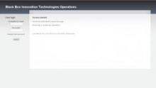
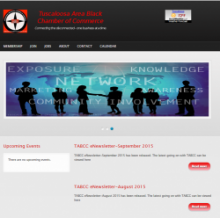
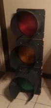

# Portfolio

## Black Box Operations

Black Box Operations is a project management, help desk, and invoicing system all rolled into one. This web application allows BBIT staff and BBIT clients to stay up-to-date with the status of their project and submit maintenance requests for their website(s). The system also emails invoices to clients and allows clients to login to pay their invoices. By having all of the information located in a central location, BBIT is able to produce quality work, in a timely fashion.

## NAACP, University of Alabama Chapter

University of Alabama Chapter of the National Association for the Advancement of Colored People (UA NAACP) is a student organization at University of Alabama, in Tuscaloosa, Alabama. The website allowed UA NAACP to recruit prospective and current students to attend organization meetings, events, and functions.

## Tuscaloosa Area Black Chamber of Commerce

The Tuscaloosa Area Black Chamber of Commerce (TABCC) serves to promote Black and minority-owned businesses in the 7th congressional district of Alabama and the West Alabama areas. TABCC now has an informational website for current and prospective members, upcoming events, and community and TABCC news bulletins.

## Raspberry Pi Traffic Light Control

The purpose of this project is to educate children about the STEM (Science, Technology, 
Engineering, and Mathematics) fields. Through the use of low cost devices and effective teaching, by grouping these subjects together, children are able to associate what they are learning with interactions with everyday items. For example, most children are aware of the purpose of a traffic light, but most are not aware of a traffic lights' internal workings. This project is designed to educate children by explaining the workings of the ""black box"" of a traffic light. This project targets the ""T, E, and M"" of ""STEM"" by using electronic circuits for controlling the lights, software for controlling the electronic circuits, and mathematical calculations for making timing decisions.

This project is intended to be used with two traffic lights. Northbound (NB) light has a left turn yellow and green arrows in addition to the standard 3-segement light. Eastbound (EB) light only has a standard 3-segment light. It is possible to only connect one traffic light assembly to the board as all code will still function.

Code for this project is downloadable from our GitHub page at 
<a href="https://github.com/bitsecondal/raspitraffic-stem" target="_blank">https://github.com/bitsecondal/raspitraffic-stem</a>. 

